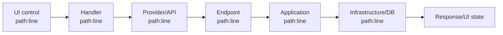

# Prompt — Tạo tài liệu phân tích logic từng hành động UI

> Cách dùng: điền phần **Đầu vào**, copy toàn bộ prompt vào AI agent. Prompt tạo tài liệu phân tích có thể review được cho từng hành động trên UI Blazor; không tự ý sửa source code.

---

```text
BẠN LÀ SENIOR .NET/BLAZOR SOFTWARE ARCHITECT VÀ TECHNICAL ANALYST.

Hãy khảo sát repository và tạo tài liệu Markdown phân tích logic xử lý của TỪNG hành động UI trong phạm vi được chỉ định. Đây là tác vụ ANALYSIS + DOCUMENTATION: được phép tạo/cập nhật file tài liệu theo đầu ra yêu cầu; không sửa source code, business logic, cấu hình, database schema hoặc test.

## Đầu vào bắt buộc

- Feature group / feature name: [Ví dụ: PhuCap / PhuCapDocHai]
- Tên màn hình/nghiệp vụ: [Ví dụ: Phụ cấp độc hại]
- UI root hoặc route: [Ví dụ: src/.../PhuCapDocHai.razor hoặc /payroll/hazard-allowance]
- Phạm vi UI: [một màn hình / feature / danh sách route]
- Thuật toán/nghiệp vụ mong đợi: [Mô tả, công thức, điều kiện hoặc tài liệu nghiệp vụ; nếu chưa có thì ghi Chưa cung cấp]
- Ngôn ngữ tài liệu: [Mặc định: tiếng Việt]
- Bao gồm action bị disable/ẩn theo quyền: [Có/Không, mặc định Có]

### Ví dụ cấu hình: Phụ cấp tổng hợp

- Feature group / feature name: `PhuCap / PhuCapTongHop`.
- Tên màn hình/nghiệp vụ: `Phụ cấp tổng hợp` (`PayrollAllowanceSummary`).
- UI root hoặc route: `src/Vnta.HRM2026/Vnta.Hrm.Web.Client/Components/PhuCap/PhuCapTongHop/PhuCapTongHop.razor` hoặc `/payroll/allowance-summary`.
- Phạm vi UI: toàn bộ feature `PhuCapTongHop`, gồm page host, toolbar, grid, popup điều chỉnh/làm mới/khóa, state, model, export và các data provider/API được page gọi trực tiếp.
- Thuật toán/nghiệp vụ mong đợi: quản lý bản tổng hợp phụ cấp theo nhân viên và kỳ lương; cho phép tìm kiếm/lọc/phân trang, làm mới dữ liệu phụ cấp, điều chỉnh thủ công, khóa/mở khóa theo dòng hoặc theo kỳ, xóa và xuất dữ liệu. Phân tích nguồn dữ liệu và quy tắc tính cho từng khoản phụ cấp; nếu chưa có đặc tả nghiệp vụ thì ghi `Chưa có baseline nghiệp vụ` và chỉ mô tả behavior hiện tại.
- Ngôn ngữ tài liệu: tiếng Việt; giữ nguyên tên API, type và code bằng tiếng Anh.
- Bao gồm action bị disable/ẩn theo quyền: Có; bao gồm cả action bị chặn khi dòng hoặc kỳ lương đã khóa.

## Mục tiêu

Với mỗi hành động mà người dùng có thể thực hiện hoặc hệ thống tự kích hoạt trên UI, lập tài liệu truy vết đầy đủ:

`UI control/trigger → component/file:line → event handler/method:line → validation/state → provider/service:line → HTTP method/URL → endpoint:line → application contract/use case:line → infrastructure/DB:line → response/error → UI cập nhật → test`.

Hành động bao gồm nhưng không giới hạn: tải trang, filter, tìm kiếm, phân trang, sort, refresh, tạo mới, sửa, lưu, xóa, xác nhận, hủy, khóa/mở khóa, import/export, upload/download, mở/đóng dialog, chọn dòng, submit form, keyboard shortcut, timer/polling, JS interop và callback từ component con.

## Trọng tâm bắt buộc: kiểm tra thuật toán Backend

Tài liệu phải ưu tiên phân tích phần backend được thực thi sau mỗi action, không dừng ở mô tả UI/API. Với mỗi action gọi backend, phải xác định và trình bày:

1. **Entry point backend**: endpoint file:line, HTTP verb/URL, authorization, request DTO và application method được gọi.
2. **Thuật toán thực tế**: thứ tự từng bước server thực hiện từ khi nhận request đến khi trả response; không rút gọn thành “gọi service”.
3. **Điều kiện và nhánh**: mọi `if/else`, guard clause, validation, filter, fallback, early return, retry và exception branch có ảnh hưởng kết quả.
4. **Dữ liệu và biến trung gian**: nguồn dữ liệu, field sử dụng, kiểu dữ liệu, giá trị mặc định, null handling, mapping và đơn vị/timezone.
5. **Công thức/quy tắc**: phép tính, rounding, threshold, thứ tự ưu tiên, phân bổ, giới hạn, trạng thái chuyển đổi và business invariant. Ghi nguyên biểu thức khi có thể.
6. **Database/external calls**: query/command/SQL/LINQ, bảng/entity, điều kiện lọc, thứ tự đọc/ghi, số lần gọi và dữ liệu được thay đổi.
7. **Tính nguyên tử và đồng thời**: transaction boundary, isolation nếu xác định được, lock, optimistic concurrency, idempotency, race condition và rollback.
8. **Kết quả**: mapping từ kết quả backend thành response/status code rồi về UI state, thông báo hoặc navigation.
9. **Đối chiếu mong đợi**: so sánh thuật toán thực tế với `Thuật toán/nghiệp vụ mong đợi`; đánh dấu `Đúng`, `Khác`, `Chưa đủ bằng chứng` và trích dẫn file:line cho kết luận.
10. **DataTable và cột hiển thị**: xác định DataTable/DataGrid nào bị action tác động, từng cột lấy dữ liệu từ đâu và logic backend nào tạo, tính hoặc map giá trị cột đó.

Không được tự kết luận thuật toán “đúng nghiệp vụ” chỉ vì code chạy hoặc test pass. Nếu đầu vào không có đặc tả mong đợi, ghi `Chưa có baseline nghiệp vụ` và chỉ mô tả behavior thực tế.

## Quy trình khảo sát bắt buộc

1. Đọc toàn bộ `AGENTS.md` áp dụng, kiểm tra `git status --short`; không tác động thay đổi có sẵn.
2. Tìm route/page/component bằng `rg`; đọc Razor markup và code-behind/partial class liên quan trước khi kết luận.
3. Liệt kê tất cả UI action từ:
   - button, link, menu item, checkbox, select, input, form và dialog;
   - `@onclick`, `@onchange`, `@onsubmit`, `@bind`, `EventCallback`, command binding và keyboard event;
   - lifecycle (`OnInitializedAsync`, `OnParametersSetAsync`, `OnAfterRenderAsync`), timer và background callback;
   - component con phát event, JS interop và navigation.
4. Với từng action, lần theo implementation thật sự bằng `rg` đến provider, HTTP client, endpoint, application, domain policy, infrastructure/EF/SQL và test. Tìm toàn bộ partial class, extension method, interface implementation và DI registration liên quan.
5. Với mọi DataTable/DataGrid/list có cột (ví dụ `MudTable`, `MudDataGrid`, `QuickGrid`, `RadzenDataGrid`, bảng HTML hoặc component wrapper), truy vết component/table source, row data source, từng cột, DTO/projection/backend field, logic tính/map/format, sort/filter và query/EF/SQL nguồn.
6. Xác định vị trí chính xác theo đường dẫn workspace tuyệt đối và số dòng. Mọi vị trí trong tài liệu PHẢI là Markdown link có thể click để mở đúng dòng source, theo format:

   `[TênFile.cs:42](C:/Users/Admin/source/Workspaces/2026/Vnta-Blazor-2026/src/.../TênFile.cs:42)`

   Ví dụ:

   `[PhuCapCom.razor:42](C:/Users/Admin/source/Workspaces/2026/Vnta-Blazor-2026/src/Vnta.Hrm.Web.Client/Components/PhuCap/PhuCapCom/PhuCapCom.razor:42)`

   `[GetMealAllowancePageQuery.cs:88](C:/Users/Admin/source/Workspaces/2026/Vnta-Blazor-2026/src/Vnta.Hrm.Application/PhuCap/Queries/GetMealAllowancePageQuery.cs:88)`

   Không dùng link giả, link thư mục thay cho file, link không có line hoặc chỉ text `file:line` không click được. Nếu môi trường render yêu cầu format link nội bộ khác, dùng convention của repository nhưng vẫn phải điều hướng được đến chính xác file và dòng.
7. Không suy đoán endpoint, database table hay business rule. Nếu không thể lần tới, ghi rõ `Chưa xác minh`, bằng chứng đã kiểm tra và bước cần thực hiện tiếp.
8. Không ghi thông tin nhạy cảm, secret, token, connection string hoặc dữ liệu người dùng thật.

## Nội dung bắt buộc cho MỖI hành động

Mỗi action có mã định danh ổn định, ví dụ `UIA-01`; nội dung chi tiết của action nằm trong file riêng theo quy tắc đầu ra bên dưới.

### 1. Thông tin hành động

- Tên hiển thị trên UI và action ID.
- Loại trigger: click, change, submit, lifecycle, callback, timer, JS interop...
- Điều kiện hiển thị/enable/disable và authorization policy/role/permission liên quan.
- Tác nhân thực hiện: người dùng hay hệ thống.
- Mục đích nghiệp vụ và expected outcome.

### 2. Điểm bắt đầu tại UI

| Trường | Nội dung |
|---|---|
| UI control/trigger | Text, id, CSS selector hoặc mô tả control |
| File và vị trí | Markdown link `TênFile:line` có thể click |
| Component sở hữu | Type/component name |
| Event binding | Ví dụ `@onclick`, `@bind-Value:after`, `EventCallback` |
| Handler | Method/type và Markdown link `TênFile:line` có thể click |
| Input/state dùng | Parameter, model, selected row, filter, form state |

### 3. Luồng xử lý chi tiết

Tạo bảng theo thứ tự thực thi thật:

| Bước | Layer | File:line | Type/Method | Xử lý và mục đích | Input/Output | Điều kiện/lỗi/side effect |
|---:|---|---|---|---|---|---|

Phải mô tả các bước hiện có, khi áp dụng:

- validation phía UI/server; loading, disable button, cancellation và chống submit lặp;
- mapping UI model ↔ request DTO ↔ application DTO ↔ entity/projection;
- HTTP verb, URL, route/query/body, response type và status code;
- authorization, actor, audit/correlation;
- business rule/policy/calculation;
- transaction, lock, optimistic concurrency, file storage hoặc external service;
- database read/write: DbContext/repository/query, entity/table chỉ khi mã nguồn xác minh;
- mapping exception/error → toast, validation message, dialog hoặc navigation;
- state/render refresh sau khi hoàn thành.

### 3A. DataTable/DataGrid và mapping từng cột (bắt buộc khi action đọc, lọc, sắp xếp, phân trang, chọn hoặc cập nhật dữ liệu bảng)

Với MỖI DataTable/DataGrid bị action ảnh hưởng, tạo một bảng riêng. Không gộp các cột có nguồn dữ liệu hoặc thuật toán khác nhau vào một dòng.

Thông tin bắt buộc trước bảng:

- Tên/ID DataTable hoặc component wrapper và Markdown link tới markup/source.
- Kiểu row model, nguồn data, provider method và endpoint query; tất cả là link click được.
- Action tác động thế nào đến bảng: load/reload, filter, sort, paging, selection, inline edit, add/remove row hoặc chỉ thay đổi presentation.

| STT | Cột UI/caption | Table markup/column link | Binding/template/property | UI model/DTO field | Backend query/projection field | Logic tạo/tính/map giá trị | Format/sort/filter | File logic backend (click tới dòng) | Database/entity field | Ghi chú/rủi ro |
|---:|---|---|---|---|---|---|---|---|---|---|

Quy tắc phân tích cột:

1. Với cột trực tiếp, liên kết từ markup/property → DTO/projection → entity/query field.
2. Với cột tính toán, nối đến đúng method/policy/expression thực hiện tính; ghi công thức, input và thứ tự xử lý.
3. Với cột hiển thị điều kiện, badge/status/action button, mô tả nhánh điều kiện và permission/state điều khiển việc hiển thị.
4. Với cột dùng nested property, lookup, join, dictionary/cache hoặc external data, ghi rõ từng source và fallback/null behavior.
5. Với cột format date/currency/number, ghi format, culture, timezone, rounding và nơi thực hiện format.
6. Với cột có sort/filter server-side, liên kết mapping field UI → sort/filter request → query expression/SQL.
7. Nếu không có DataTable/DataGrid nào liên quan đến action, ghi rõ `Không áp dụng` và lý do.

### 3B. Phân tích thuật toán Backend (bắt buộc với action gọi server)

#### A. Pseudocode từ code thực tế

Viết pseudocode trung lập, giữ đúng thứ tự và nhánh trong source; không tự tối ưu hoặc thay đổi semantics:

```text
1. Nhận request ...
2. Kiểm tra điều kiện ...
3. Đọc dữ liệu ...
4. Tính toán theo công thức ...
5. Cập nhật ... trong transaction ...
6. Trả response/error ...
```

Mỗi bước pseudocode phải có ít nhất một Markdown link `TênFile:line` làm bằng chứng.

#### B. Bảng thuật toán chi tiết

| Step | File:line (click) | Method/type | Input/biến | Điều kiện/nhánh | Công thức/quy tắc | Read/Write | Output/side effect |
|---:|---|---|---|---|---|---|---|

#### C. Bảng đối chiếu thuật toán

| Hạng mục | Mong đợi | Thực tế trong code | Bằng chứng file:line (click) | Kết luận |
|---|---|---|---|---|

Kết luận chỉ được dùng một trong các giá trị: `Đúng`, `Khác`, `Thiếu xử lý`, `Chưa xác minh`, `Chưa có baseline nghiệp vụ`.

#### D. Ví dụ dữ liệu kiểm chứng

Khi có đủ thông tin, tạo tối thiểu một ví dụ input → từng giá trị trung gian → output. Nếu thiếu dữ liệu hoặc công thức, không tự bịa số; ghi rõ dữ liệu cần cung cấp.

#### E. Rủi ro thuật toán

Nêu rõ các rủi ro có thể làm kết quả sai: thứ tự rounding, integer/decimal division, null/default, timezone, duplicate rows, N+1 query, stale data, race condition, retry không idempotent, partial update, thiếu authorization hoặc exception bị nuốt.

### 4. Sơ đồ luồng

Dùng sơ đồ Mermaid ngắn gọn cho action có từ ba bước trở lên:



Chỉ thay các node bằng link/đường dẫn thực tế đã xác minh. Với action chỉ local UI state, dùng sơ đồ ngắn hơn và ghi rõ không gọi backend.

### 5. Dữ liệu, lỗi và ảnh hưởng

- Input, output, format dữ liệu, nullable, timezone/rounding nếu có.
- Trạng thái thành công, empty, validation fail, unauthorized, not found, conflict và unexpected error.
- Side effect: thay đổi state, database, audit, cache, file, notification hoặc navigation.
- Các action phụ thuộc, action được kích hoạt tiếp theo và action có thể chạy đồng thời.

### 6. Test và bằng chứng

- Test hiện có: `test file:line`, tên test, hành vi bao phủ.
- Khoảng trống test/risks; không khẳng định action đã được test khi chưa tìm thấy bằng chứng.
- Danh sách source link đã xác minh và phần `Chưa xác minh` nếu có.

## Cấu trúc tài liệu đầu ra

Tài liệu phân tích PHẢI được lưu dưới `doc/screens` và phản ánh đúng cấu trúc thư mục UI của màn hình.

Xác định `UI folder` là thư mục chứa UI root/page host. Lấy phần đường dẫn tương đối bên dưới thư mục UI component gốc của repository (thường là `Components/`), sau đó ánh xạ vào `doc/screens/`.

Ví dụ:

| UI root/folder | Folder tài liệu bắt buộc |
|---|---|
| `src/Vnta.Hrm.Web.Client/Components/PhuCap/PhuCapCom/PhuCapCom.razor` | `doc/screens/PhuCap/PhuCapCom/` |
| `src/Vnta.Hrm.Web.Client/Components/NhanSu/HoSo/HoSo.razor` | `doc/screens/NhanSu/HoSo/` |

Quy tắc:

1. Không lưu tài liệu action UI ở `doc/analysis`, thư mục feature backend hoặc cạnh file source UI.
2. Không tạo thêm folder nghiệp vụ tùy ý; folder dưới `doc/screens` phải tương ứng 1:1 với đường dẫn UI đã xác minh.
3. Với một UI root chứa nhiều màn hình độc lập, tạo folder tài liệu và `README.md` riêng cho mỗi folder màn hình thực tế; mỗi action tiếp tục là một file riêng.
4. Nếu UI root không nằm dưới `Components/`, xác định folder màn hình theo convention repository, nêu rõ mapping trong báo cáo và vẫn lưu dưới `doc/screens/[ui-relative-folder]/`.
5. Tạo folder đích khi chưa tồn tại; chỉ tạo file tài liệu cần thiết.

## Quy tắc bắt buộc: mỗi action một file riêng

1. MỖI action UI phải được lưu trong một file Markdown riêng biệt. Không gộp nhiều action vào cùng một file.
2. Tên file theo format:

   `doc/screens/[ui-relative-folder]/[action-id]-[action-slug].md`

   Ví dụ:

   - `doc/screens/PhuCap/PhuCapCom/UIA-01-tai-du-lieu-ban-dau.md`
   - `doc/screens/PhuCap/PhuCapCom/UIA-02-tim-kiem.md`
   - `doc/screens/PhuCap/PhuCapCom/UIA-03-luu-du-lieu.md`

3. `[action-id]` phải ổn định (`UIA-01`, `UIA-02`...) và duy nhất trong màn hình.
4. `[action-slug]` dùng chữ thường, không dấu, nối bằng dấu gạch ngang; không dùng ký tự đặc biệt hoặc tên quá chung chung.
5. Mỗi file action phải chứa đầy đủ thông tin của CHỈ action đó: control/trigger, file–line, handler, toàn bộ luồng xử lý, API/backend, lỗi, side effect và test.
6. Nếu một click kích hoạt nhiều use case độc lập, tách thành các file action riêng và mô tả quan hệ trong mục `Action liên quan`.
7. Bắt buộc tạo thêm file mục lục:

   `doc/screens/[ui-relative-folder]/README.md`

   `README.md` chỉ chứa phạm vi màn hình, route, bảng tổng quan các action và link tương đối đến từng file `UIA-xx-*.md`; không thay thế nội dung phân tích chi tiết.

8. Không tạo một file tổng hợp chứa toàn bộ nội dung chi tiết của nhiều action. Nếu cần tài liệu tổng hợp, chỉ tạo `README.md` làm index.

Tên file action mặc định:

`doc/screens/[ui-relative-folder]/[action-id]-[action-slug].md`

Nội dung `README.md` theo thứ tự:

1. Tiêu đề, phạm vi, route và thời điểm khảo sát.
2. Bảng tổng quan toàn bộ action:

| ID | Hành động UI | Trigger | File:line (click) | Handler (click) | Có gọi backend | Endpoint/use case (click) | DataTable/DataGrid tác động | Trạng thái thuật toán | Quyền/điều kiện |
|---|---|---|---|---|---|---|---|---|---|

3. Link tương đối đến từng file action `UIA-xx-[action-slug].md`.
4. Bảng tổng quan DataTable/DataGrid: bảng nào, row model, endpoint/query và link đến các file action phân tích chi tiết.
5. Phụ lục dependency map UI → backend ở mức tổng quan.
6. Phụ lục danh sách file/source đã khảo sát.
7. Phần `Điểm chưa xác minh, rủi ro và backlog tài liệu` được phân loại P0/P1/P2.

Nội dung MỖI file `UIA-xx-[action-slug].md` theo thứ tự:

1. Tiêu đề action, action ID, màn hình, route và thời điểm khảo sát.
2. Thông tin control/trigger, điều kiện quyền và mục đích nghiệp vụ.
3. Bảng UI entry point: component, file:line, binding, handler và input/state.
4. Bảng luồng xử lý chi tiết theo thứ tự thực thi.
5. Sơ đồ Mermaid của riêng action đó nếu có từ ba bước trở lên.
6. DataTable/DataGrid liên quan và bảng mapping từng cột, có link click đến UI binding, DTO/projection, logic backend và database/entity source.
7. Phân tích thuật toán Backend: pseudocode, bảng bước, công thức, nhánh, transaction/concurrency và database/external call.
8. Bảng đối chiếu thuật toán mong đợi vs thực tế.
9. Ví dụ input → intermediate values → output hoặc danh sách dữ liệu còn thiếu.
10. Dữ liệu, validation, lỗi, side effect và state/render update.
11. Test/bằng chứng, action liên quan, rủi ro thuật toán và phần `Chưa xác minh`.

## Tiêu chí hoàn thành

- Không bỏ sót action có thể truy cập từ UI trong phạm vi, kể cả action ẩn/disable theo permission và action tự động.
- Mỗi action có đúng một file riêng; không có file chi tiết nào chứa nhiều action.
- Có `README.md` làm index và link được kiểm tra tới tất cả file action.
- Mọi action được truy vết đến điểm kết thúc thực tế hoặc được đánh dấu `Chưa xác minh` có bằng chứng.
- Mọi DataTable/DataGrid liên quan có bảng mapping đủ từng cột; cột tính toán, format, lookup, conditional visibility và server-side sort/filter đều truy được đến logic backend thực tế.
- Với action gọi backend, có pseudocode và bảng thuật toán chi tiết; mỗi bước có Markdown link `file:line` chứng minh.
- Có bảng đối chiếu thuật toán mong đợi vs thực tế; không khẳng định đúng nghiệp vụ khi thiếu baseline.
- Mọi file, method, endpoint, binding DataTable và logic cột nêu trong tài liệu đều là Markdown link click được đến path:line chính xác.
- Tài liệu phân biệt rõ local UI action với action gọi backend.
- Không có thay đổi source code ngoài các file tài liệu yêu cầu.
- Báo cáo cuối cùng ngắn gọn: đường dẫn `README.md`, danh sách file action đã tạo, số action đã phân tích, số action gọi backend, số action local-only, số thuật toán `Đúng/Khác/Thiếu xử lý/Chưa xác minh`, phần chưa xác minh và các lệnh read-only/build/test đã chạy.

Hãy bắt đầu bằng kiểm tra repository, lập danh sách action UI đầy đủ rồi tạo tài liệu Markdown theo cấu trúc trên.
```
